# Project: StudentListDisplay_FormAnimeSoCute_Laravel11

## The project StudentListDisplay_FormAnimeSoCute_Laravel11 is a registration and login form with a cute Anime interface built with Laravel 11. It features the ability for users, after logging in or registering an account, to display a list of students and to add, delete, or edit student information if desired.

### 1. Install Laravel 11

-   **Command to install Laravel.** composer create-project laravel/laravel project_1
-   Laravel completes the installation process and automatically creates 3 tables: `users`, `cache`, `jobs`.
  
    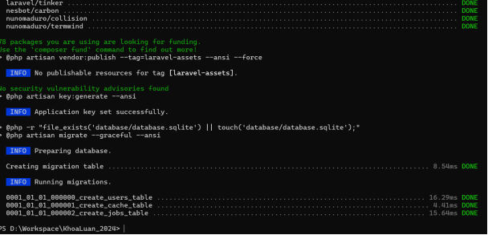
    
-   Successfully installed Laravel 11.25.0.
  
    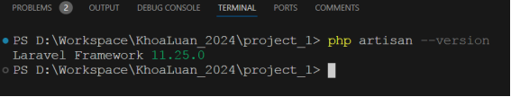

### 2. Design the STUDENTS Table

**The STUDENTS table** includes the following main attributes:
| Field Name | Type | Description |
|------------------|-------------|-----------------------------------------------------|
| ID | Integer | Primary key: Auto-increment. |
| NAME | String | Name |
| EMAIL | String | Email: Unique email format. |
| PASSWORD | String | Password: Cannot be empty + encrypted |
| STUDENT_CODE | Integer | Student code: Cannot be empty, 8 characters |
| CLASS | String | Class |
| FACULTY | String | Faculty |

### 3. Prepare the Database

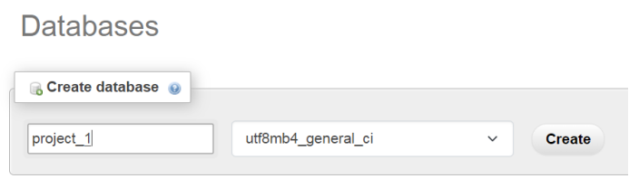

-   Create a database name in phpMyAdmin.
  
    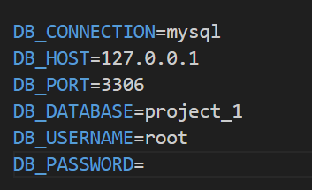
    
-   Configure the database in the `.env` file within the project directory.

### 4. Create Migrations

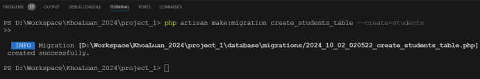

-   Create a migration for the Students table.
-   Edit the migration: add necessary fields.
  
    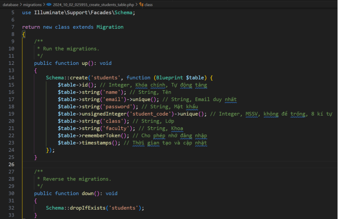
    
-   Run `php artisan migrate` to create the students table in the database.

  [alt text](image-7.png)

  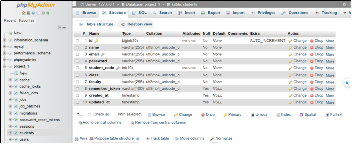

### 5. Create and Configure Model

-   **Command to create Model.**
  
   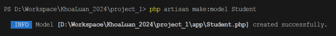

   

### 6. Create and Configure Controller

-   **Command to create StudentController.**
  
    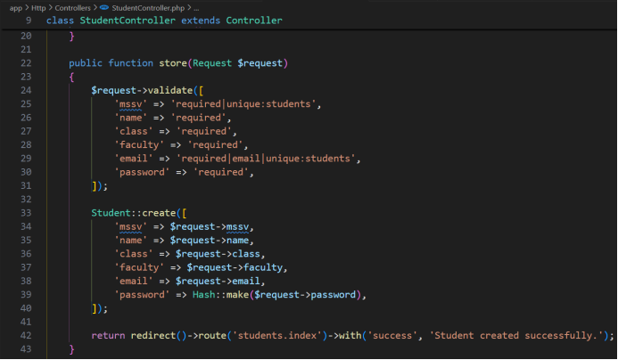
    
-   **Add Student** (Create).
  
    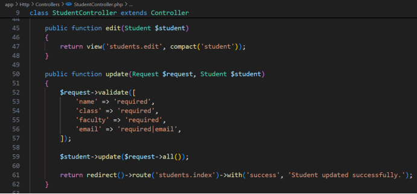
    
-   **Edit Student Information** (Update).
-   **Delete Student Information** (Destroy).
  
    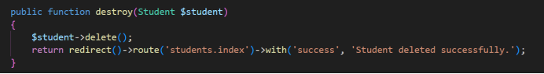
    
-   Modify
  
    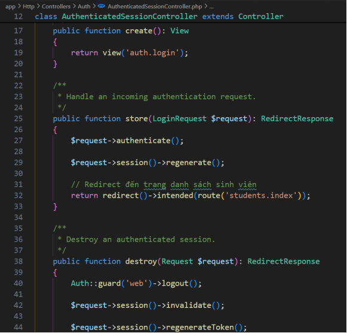
    
    `AuthenticatedSessionController` so that after login, users will be redirected to the student list page.

### 7. Add Router

### 8. Create the Interface

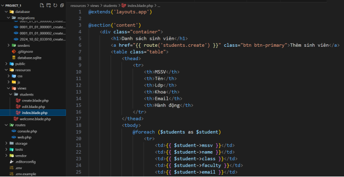

-   Create the directory `resources/views/students` and add the following files:
    -   `index`: for navigation and containing student information.
    -   `create`: for creating/adding students.
    -   `edit`: for editing student information.

### 9. Results

-   Run `php artisan serve` to display the following results: - First, go to the welcome page allowing user login/registration.
- **Registration Form:**
  
    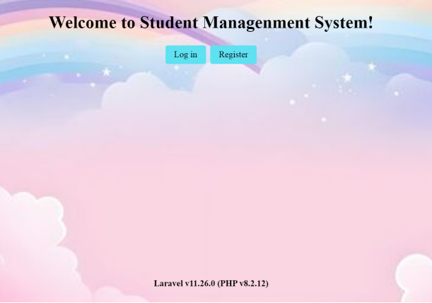
  
-   Data validation result: Password must be at least 8 characters to register an account. - **Login and Register Form:**
  
    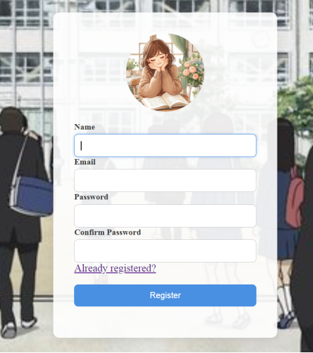
    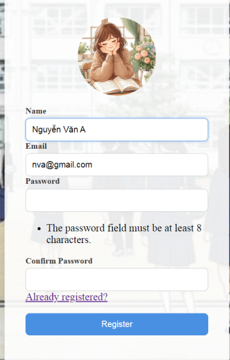
    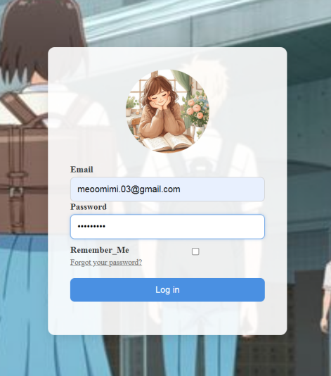
    
-   After logging in, display the Student List page along with the user information, allowing for adding, editing, and deleting students. Users can also log out and return to the welcome page if needed.
- **Add Student Page:**

    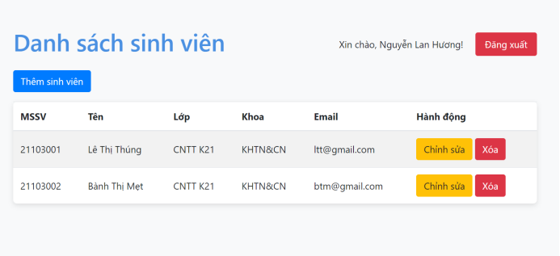
  
    Allows adding new students.
- **Edit Student Information Page:**
    
    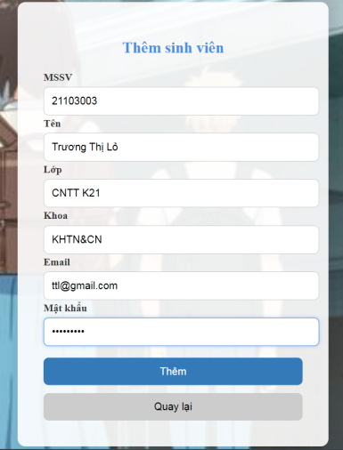
    
    Allows editing information, updating, and returning to the student list page. - Result: Added Trương Thị Lỏ to the list and edited Trường to Lê in the student list.
- **Database**
    
    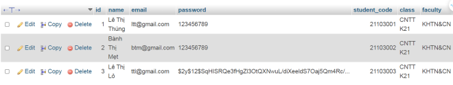

    After adding the new student is also displayed in the `students` table.

_Note:_ Lê Thị Thúng and Nguyễn Thị Mẹt were created in phpMyAdmin, so their passwords are not encrypted, while Lê Thị Lỏ was created through the add student function, so her password is encrypted.

### 10. Conclusion

Based on references from the Laravel documentation and especially “Chat GPT”, I have successfully:

-   Installed Laravel 11, created a database with existing tables, and added a Students table in the database named `project_1`.
-   Created an interface for user login/registration.
-   Displayed the student list after logging in.
-   Allowed adding, editing, and deleting student information.

=====================End========================
